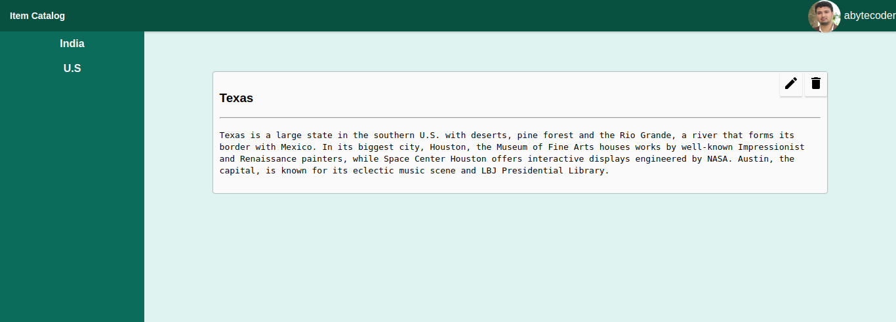

# Item Catalog

This project is the **fourth** project in the Udacity full stack developer nano degree course. In this project users can add/edit/delete categories and items. Sign In to the application is done either via **Facebook** or **Google** accounts. The project is designed to be responsive i.e It would look great in Desktop, Mobile and Tablet devices.

## Initital Setup
- Clone or Download this repo and cd to the item-catalog folder
- Follow the instructions from [here](https://docs.google.com/document/d/1jFjlq_f-hJoAZP8dYuo5H3xY62kGyziQmiv9EPIA7tM/pub?embedded=true)
- Install Markdown for python using ``` pip install Flask-Markdown ```
- Run the project using ``` python3 start_server.py ```
- Now the project is running in port 5000 so to access in browser go to [http://localhost:5000](http://localhost:5000) ( Note descriptions can be written using Markdown).
- All routes for API's begin with /api/v1/

## Some Screenshots




